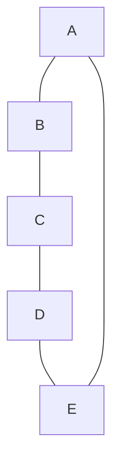

# Chromatic aberration

[Source](chromatic-aberration.cpp) · [Technical notes](NOTES.md#chromatic-aberration) · [Research and compiler evidence](working-notes/14-chromatic-aberration.md)

The trick is **turning “these two dots need different colors” into “these two
empty objects need different addresses.”**

Let's build that connection.

First, forget C++. We have five dots connected in a ring:



“Coloring the graph” just means assigning colors to the dots, with one rule:
**dots connected by a line must have different colors.** Dots without a
connecting line may share a color.

Go through them in order, always choosing the first allowed color:

| Dot | What blocks its choice? | Color |
| --- | --- | --- |
| A | Nothing yet | Red |
| B | Connected to red A | Blue |
| C | Connected to blue B | Red |
| D | Connected to red C | Blue |
| E | Connected to blue D **and red A** | Green |

So we used three colors. That procedure is called *greedy coloring*: make each
choice using what you've already assigned.

Now for the C++ weirdness.

Empty base classes can share an address. For example:

```cpp
struct X {};
struct Y {};
struct Both : X, Y {};
```

On our tested compilers, the `X` and `Y` subobjects both fit at byte offset zero.
Neither contains any data that would overwrite the other.

But **two separate empty subobjects of the same type cannot share an address**
in our construction. Two `X`s need separate positions.

That is our “must have different colors” rule!

We represent each **line** in the picture with an empty type:

```cpp
struct ab {}; // The line connecting A and B.
struct bc {};
struct cd {};
struct de {};
struct ea {};
```

Then each **dot** inherits the types representing the lines touching it:

```cpp
struct A : ab, ea {};
struct B : ab, bc {};
struct C : bc, cd {};
struct D : cd, de {};
struct E : de, ea {};
```

Look specifically at `A` and `B`:

- `A` contains an `ab` subobject.
- `B` contains another `ab` subobject.
- Put A and B at the same address, and those two `ab`s collide.
- Therefore A and B need different addresses.

But A and C share no base type, so they can occupy the same address.

**We've encoded the drawing's connections as restrictions on which objects
may overlap.**

Finally, ask the compiler to arrange all five vertices:

```cpp
struct pentagon : A, B, C, D, E {};
```

For these empty classes, the tested layout algorithm tries byte offset zero,
then one, then two, stopping at the first position without a collision.

Watch what happens:

| Compiler places… | Placement |
| --- | --- |
| A | Byte 0 |
| B | Byte 0 conflicts with A's `ab`; use byte 1 |
| C | Byte 0 is available; sharing with A is fine |
| D | Byte 0 conflicts with C's `cd`; use byte 1 |
| E | Byte 0 conflicts with A's `ea`; byte 1 conflicts with D's `de`; use byte 2 |

Those are **exactly the color choices from our first table**, with byte offsets
replacing color names.

Therefore:

```cpp
static_assert(sizeof(pentagon) == 3);
```

The compiler's attempt to squeeze empty objects together **is the graph-coloring
algorithm**. `sizeof` reads how many byte positions it needed.

And `pentagon` still qualifies as an empty class: no data members anywhere.
Its three bytes exist to keep conflicting empty subobjects apart.

The precise packing depends on the ABI, and greedy coloring doesn't always find
the fewest possible colors. But this five-dot example really does get colored
by the compiler's object-layout machinery. The
[Itanium ABI allocation rule](https://itanium-cxx-abi.github.io/cxx-abi/abi.html#non-pod)
explains the first-available-offset behavior on the tested targets.

The [complete source](chromatic-aberration.cpp) also demonstrates how to read
each individual color using `[[no_unique_address]]` members and `offsetof`.
The [research notes](working-notes/14-chromatic-aberration.md) cover the GCC/Clang
checks, a case where greedy coloring uses an unnecessary extra color, and the
separate NAND/XOR circuit interpretation.
